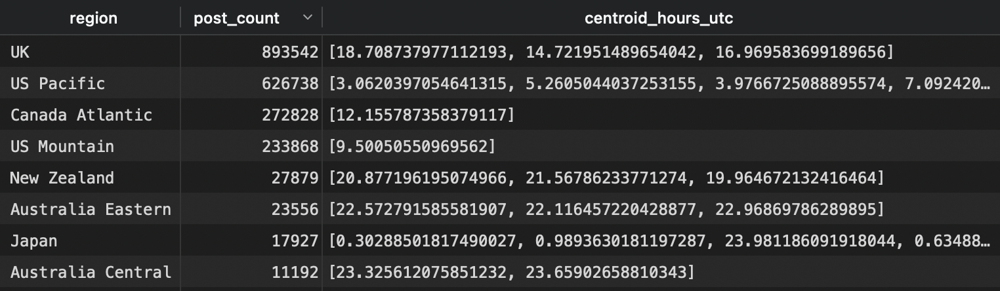

## Methods Plus Mastery - Data Engineering Assignment

### Assignment

This project creates an ETL pipeline that analyzes BlueSky [social media posts](https://huggingface.co/datasets/alpindale/two-million-bluesky-posts/blob/main/README.md) using K-means clustering to identify user activity patterns across different time zones. Post timestamps are processed to map user activity to geographical regions, with insights continuously updated in a SQLite database, demonstrating efficient handling of large-scale social media data.

### Data Analysis Pipeline
This code analyzes posting patterns in a BlueSky social media dataset to determine likely geographical regions of user activity based on post timestamps. It uses K-means clustering to group posts by their UTC timestamp hours, converting these times into cyclical features (using sine and cosine) to handle the day/night wraparound effect. For each cluster center, it matches the peak activity hour to typical working hours (9AM-5PM) in different time zones worldwide, assigning each cluster a likely geographical region with a confidence score. Finally, it aggregates these insights by region and stores them in a SQLite database using an upsert operation to maintain updated statistics about posting patterns across different global regions.

## Getting Started on MacOS


### Prerequisites

Before you begin, ensure you have the following installed:
- Git 2.47.0+
- Python 3.13.2+
- Docker 27.4.0+
- Docker Compose 2.32.4+

## Installation

### Clone or Download Repository

You can either clone the repository using SSH:
```bash
git clone git@github.com:sshaginyan/methods_plus_mastery.git
```

Or download and extract it using curl:
```bash
curl -L https://github.com/sshaginyan/methods_plus_mastery/archive/refs/heads/main.zip -o methods_plus_mastery.zip && unzip methodsplusmastery.zip && rm -rf methodsplusmastery.zip
```

### Quick Run Through Docker and Docker Compose

The fastest way to run the application is to use Docker Compose:
```bash
cd methods_plus_mastery-main
docker-compose up
```

### Run On Host Machine

1. Navigate to the project directory:
```bash
cd methods_plus_mastery-main
```

2. Create a virtual environment:
```bash
python3 -m venv .venv
```

3. Activate the virtual environment:
```bash
source .venv/bin/activate
```

4. Install all dependencies using pip:
```bash
python -m pip install -r requirements.txt
```

5. To run the application:
```bash
python src/main.py
```

### What You'll See

Logs:
```bash
2025-02-07 01:20:08.464 | INFO     | __main__:<module>:65 - Starting the dataset loading process.
Resolving data files: 100%|█████████████████████████████████████████████████████████████████████████████████████████████████████████████████████████████████| 23/23 [00:00<00:00, 100.33it/s]
2025-02-07 01:20:14.961 | INFO     | __main__:<module>:68 - Dataset loaded successfully and converted to pandas DataFrame.
2025-02-07 01:20:14.962 | INFO     | __main__:<module>:70 - Starting analysis using TimezoneClusterAnalyzer.
2025-02-07 01:20:14.962 | INFO     | timezone_cluster_analyzer:__init__:22 - Initialized TimezoneClusterAnalyzer with 24 clusters.
2025-02-07 01:20:15.122 | INFO     | timezone_cluster_analyzer:analyze:72 - Starting analysis on dataframe with 2107530 records.
2025-02-07 01:20:16.200 | INFO     | timezone_cluster_analyzer:_extract_features:37 - Converted 'created_at' to datetime.
2025-02-07 01:20:16.264 | INFO     | timezone_cluster_analyzer:_extract_features:50 - Extracted and transformed cyclical time features.
2025-02-07 01:20:16.264 | INFO     | timezone_cluster_analyzer:_extract_features:53 - Features scaled.
2025-02-07 01:20:17.851 | INFO     | timezone_cluster_analyzer:analyze:78 - Clustering complete. 24 clusters formed.
2025-02-07 01:20:17.851 | INFO     | timezone_cluster_analyzer:analyze:85 - Cluster centers converted back to hours.
2025-02-07 01:20:59.529 | INFO     | __main__:<module>:73 - Analysis completed.
2025-02-07 01:20:59.697 | INFO     | __main__:<module>:89 - Summarizing results by region.
2025-02-07 01:20:59.700 | INFO     | __main__:<module>:103 - Database connection established.
2025-02-07 01:20:59.702 | INFO     | __main__:upsert:59 - Data upserted successfully into regional_activity_clusters.
2025-02-07 01:20:59.702 | INFO     | __main__:<module>:119 - Data processing and upserting completed. Check 'file.log' for more details.
```

Files:
- ./output/file.log - *same logs as above except in a file.*
- ./output/methods_plus_mastery.db - *Our SQLite3 database with insights*

methods_plus_mastery.db looks like

